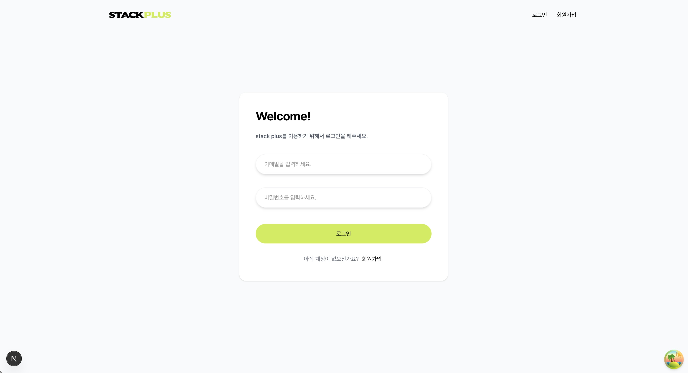
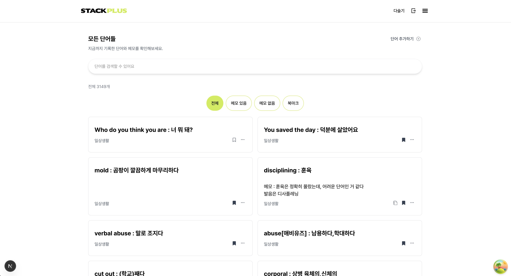
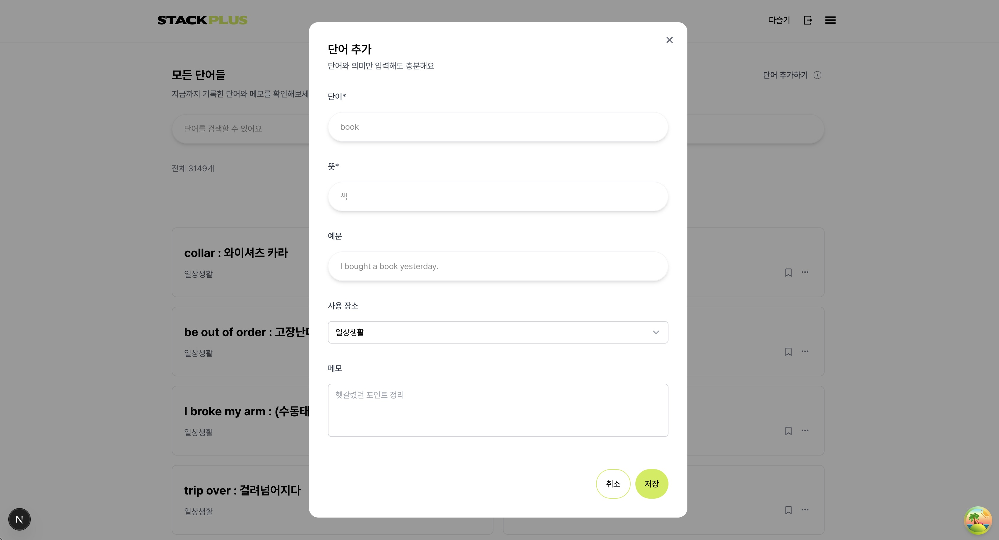
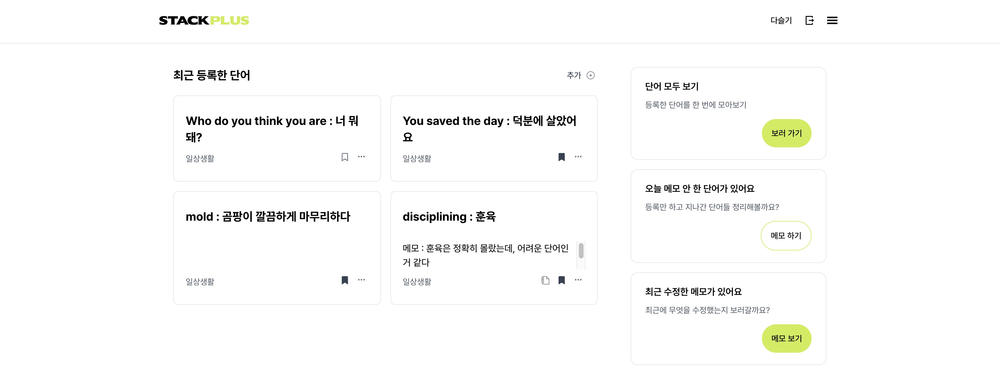
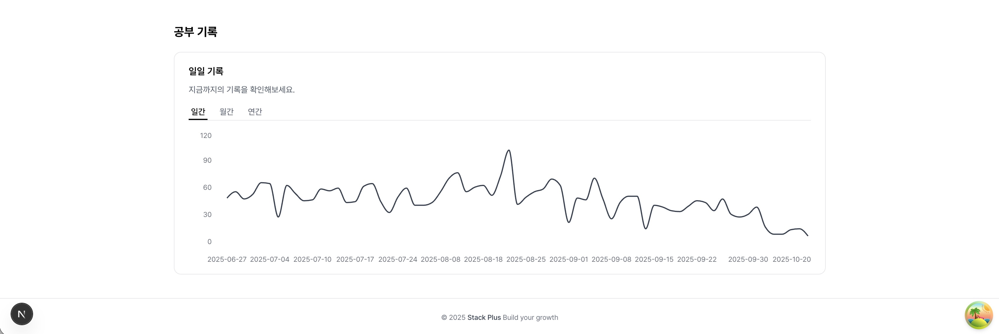

# StackPlus

    - 영어 단어를 장기적으로 관리하고 학습하기 위해 만든 개인 프로젝트
    - CRUD, 검색 최적화, 서버 사이드 페이지네이션을 직접 설계·구현한 영어 단어 학습 웹 애플리케이션

## 📸 미리보기

### 로그인



    - Supabase Auth를 활용한 이메일 기반 로그인
    - 앱 최초 진입 시 세션을 확인한 후 인증 상태를 초기화하여 인증 플리커링 방지

### 단어 관리



- 단어 CRUD
- 검색 + 필터링
- 북마크 기능

### 단어 추가



- 단어, 의미, 예문, 메모 관리
- 중복 단어 입력 방지

### 학습 대시보드




- 최근 등록한 단어 / record / filter 페이지로 이동
- 일간 / 월간 / 연간 학습 기록 시각화

## 주요 기능

### 📚 단어 관리

- **단어 추가 / 수정 / 삭제**
  - 단어, 의미, 예문, 용도, 메모 등 학습에 필요한 정보 관리
- **중복 단어 방지**
  - 입력값 대소문자 및 공백 정규화
  - Supabase `ilike` 기반 중복 검사
  - 중복 발견 시 기존 단어 상세 페이지로 이동
- **북마크**
  - 자주 복습할 단어를 북마크하여 빠르게 접근 가능

### 🔍 검색 및 필터링

- **실시간 검색**
  - 디바운싱(300ms)을 적용하여 불필요한 API 요청 최소화
- **필터링**
  - 전체 / 북마크 / 메모 있음 / 메모 없음 기준 분류
- **페이지네이션**
  - Supabase `range`를 활용한 서버 사이드 페이지네이션
  - 페이지당 20개 단위로 데이터 로딩

### 📊 학습 기록

- **일간 / 월간 / 연간 차트**
  - 학습 진행 상황을 시각적으로 확인
- **대시보드**
  - 최근 학습 단어 및 누적 학습 통계 제공

---

## 기술 스택

### Frontend

- **Next.js 14 (App Router)**
- **TypeScript**
- **Tailwind CSS**
- **React Query (TanStack Query)**
  - 서버 상태 캐싱 및 관리
  - mutation 이후 `invalidateQueries`를 통한 서버 상태 재동기화
- **Zustand**
  - 로그인 사용자 정보 및 인증 초기화 상태 전역 관리

### Backend & Database

- **Supabase (PostgreSQL)**
- **Supabase Auth**
  - 사용자 인증 흐름
    1. 앱 최초 진입 시 세션 확인
    2. 세션 확인 완료 후 `isInitialized` 상태 설정
    3. 인증 여부에 따라 보호된 페이지 접근 제어
    4. 로그아웃 시 사용자 정보 초기화

### 라이브러리

- **Recharts** - 학습 기록 차트 시각화
- **Sonner** - 사용자 피드백을 위한 Toast 알림

---

## ⚙️ CI / CD

### GitHub Actions (CI)

GitHub Actions를 활용해 **코드 변경 시 자동으로 검증이 수행되는 CI 파이프라인**을 구성했습니다.

- `dev` 브랜치에 push 또는 Pull Request 생성 시 CI 자동 실행
- GitHub Actions Runner(`ubuntu-latest`) 환경에서 작업 수행
- Node.js 20 및 pnpm 기반 의존성 설치 자동화
- CI 실행 결과를 통해 코드 변경 사항의 안정성 사전 검증

````text
.github/workflows/ci.yml


🚀 Deployment

Vercel을 활용한 Next.js 애플리케이션 배포

Supabase 관련 환경 변수를 배포 환경에서 관리

GitHub 저장소와 연동된 자동 배포 환경 구성

---


## 핵심 구현 사항

### 1. 서버 상태와 클라이언트 상태 분리

- 단어 목록, 검색 결과, 북마크 상태를 서버 상태로 관리
- 인증 상태 및 사용자 정보는 클라이언트 전역 상태(Zustand)로 분리

### 2. 검색 성능 최적화

- 디바운싱을 적용하여 입력 중 과도한 API 요청 방지
- 검색어 변경 시 React Query를 활용한 효율적인 데이터 패칭

### 3. 서버 사이드 페이지네이션

- 대량 데이터 환경에서도 성능 저하 없이 목록 제공
- 필요한 범위의 데이터만 요청하여 네트워크 비용 최소화

### 4. 중복 단어 입력 방지

- 클라이언트 입력값 정규화
- 서버 단에서 중복 여부 검증으로 데이터 신뢰성 확보

## 시작하기

### 설치

```bash
npm install
````

### 환경 변수 설정

```env
NEXT_PUBLIC_SUPABASE_URL=your_supabase_url
NEXT_PUBLIC_SUPABASE_ANON_KEY=your_supabase_anon_key
```

### 개발 서버 실행

```bash
npm run dev
```

### 개선 예정

- 테스트 코드(Jest) 추가 예정
- 현재는 단어 학습(퀴즈, 복습 주기) 기능이 부족하여
  향후 아이디어를 통해 퀴즈나, 복습 주기 기능까지 붙일 예정

### 배운 점

1. **React Query의 서버 상태 관리 방식**: 캐싱과 mutation 이후 자동 리페칭을 통한 데이터 일관성 유지칭
2. **검색 최적화의 중요성**: 디바운싱을 통해 사용자 경험과 서버 부하를 동시에 개선
3. **서버 사이드 페이지네이션의 필요성**: 데이터 규모가 커질수록 클라이언트 처리 한계를 명확히 체감
4. **인증 플로우 설계**: 초기 세션 확인 타이밍에 따라 UX 품질이 크게 달라진다는 점을 경험
