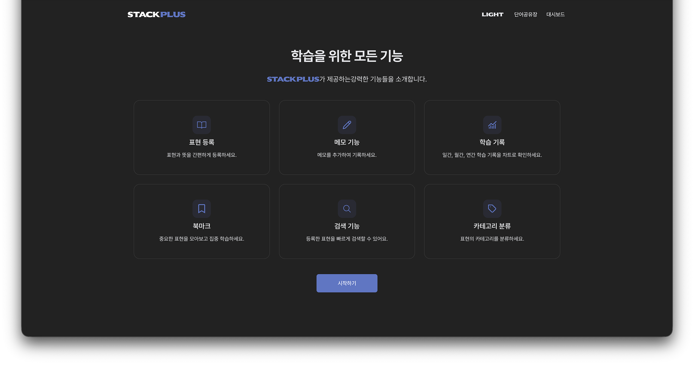
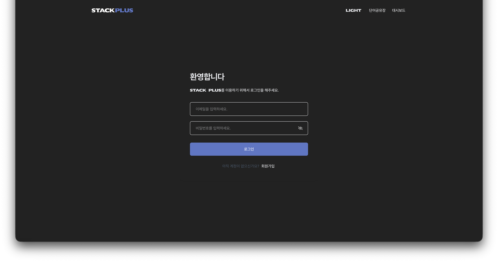
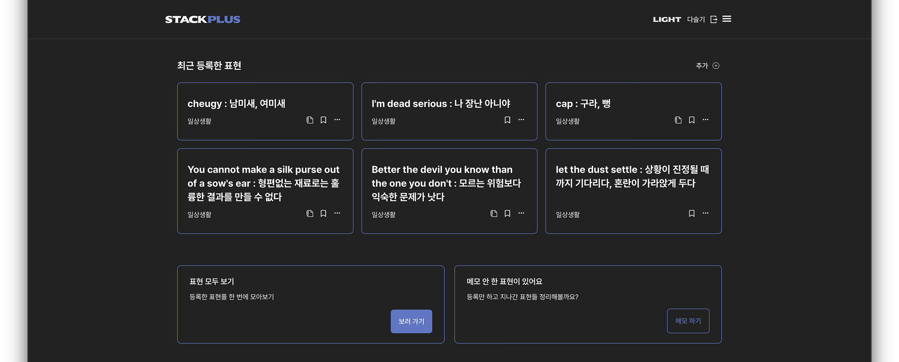
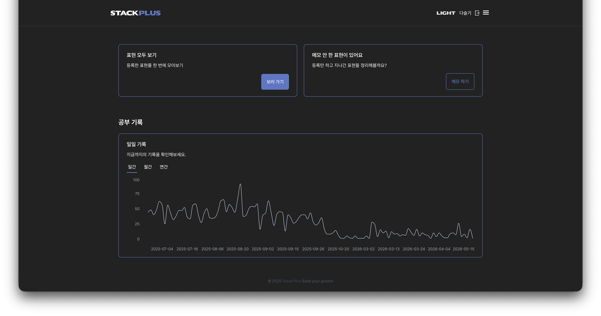
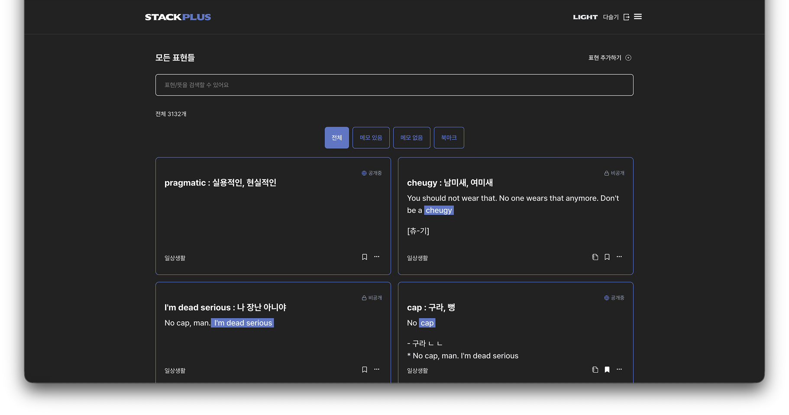
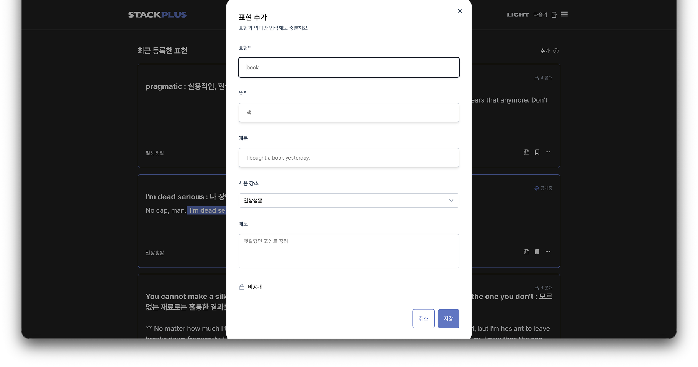

# StackPlus

영어 표현를 장기적으로 관리하고 학습하기 위해 만든 개인 프로젝트

StackPlus는 단순한 표현 암기가 아닌,
누적 학습 · 복습 · 기록 관리를 목표로 설계한
영어 표현 학습 웹 애플리케이션입니다.

표현 CRUD를 중심으로
검색, 필터링, 서버 사이드 페이지네이션, 학습 기록 시각화까지
실제 사용을 고려한 기능을 직접 설계·구현했습니다.

🔗 Demo
https://stack-plus.vercel.app/

## 📸 미리보기

### 랜딩페이지

### 로그인



    - Next.js로  초기 로딩 성능과 SEO를 개선하고, 서비스 소개와 앱 영역의 역할을 명확히 구분



    - Supabase Auth를 활용한 이메일 기반 로그인
    - 앱 최초 진입 시 세션을 확인한 후 인증 상태를 초기화하여 인증 플리커링 방지

### 학습 대시보드




    - 최근 등록한 표현 / record / filter 페이지로 이동
    - 일간 / 월간 / 연간 학습 기록 시각화
    - 누적 학습 현황을 한눈에 확인 가능

### 표현 관리



    - 표현 CRUD
    - 검색 + 필터링
    - 북마크 기능

### 표현 추가



    - 표현, 의미, 예문, 메모 등 학습 정보 관리
    - 중복 표현 입력 방지 로직 구현

## 주요 기능

### 📚 표현 관리

- **표현 추가 / 수정 / 삭제**
  - 표현, 의미, 예문, 용도, 메모 등 학습에 필요한 정보 관리
- **중복 표현 방지**
  - 입력값 대소문자 및 공백 정규화
  - Supabase `ilike` 기반 중복 검사
  - 중복 발견 시 기존 표현 상세 페이지로 이동
- **북마크**
  - 자주 복습할 표현를 북마크하여 빠르게 접근 가능

### 🔍 검색 및 필터링

- **실시간 검색**
  - 디바운싱(300ms)을 적용
  - 불필요한 API 요청 최소화
- **필터링**
  - 전체 / 북마크 / 메모 있음 / 메모 없음
- **페이지네이션**
  - Supabase `range`를 활용한 서버 사이드 페이지네이션
  - 페이지당 20개 단위로 데이터 로딩

### 📊 학습 기록

- **일간 / 월간 / 연간 차트**
  - 학습 진행 상황을 시각적으로 확인
- **대시보드**
  - 최근 학습 표현 및 누적 학습 통계 제공

---

## 기술 스택

### Frontend

- **Next.js 14 (App Router)**
- **TypeScript**
- **Tailwind CSS**
- **React Query (TanStack Query)**
  - 서버 상태 캐싱 및 관리
  - mutation 이후 `invalidateQueries`를 통한 서버 상태 재동기화
- **Zustand**
  - 로그인 사용자 정보 및 인증 초기화 상태 전역 관리
- **React Hook Form**
  - 로그인/회원가입 폼의 상태를 효율적으로 관리하고, 불필요한 리렌더링을 최소화
- **Next themes**

### Backend & Database

- **Supabase (PostgreSQL)**
- **Supabase Auth**
  - 사용자 인증 흐름
    1. 앱 최초 진입 시 세션 확인
    2. 세션 확인 완료 후 `isInitialized` 상태 설정
    3. 인증 여부에 따라 보호된 페이지 접근 제어
    4. 로그아웃 시 사용자 정보 초기화

### 라이브러리

- **Recharts** - 학습 기록 차트 시각화
- **Sonner** - 사용자 피드백을 위한 Toast 알림

---

🚀 Deployment

Vercel을 활용한 Next.js 애플리케이션 배포
Supabase 관련 환경 변수를 배포 환경에서 관리

## 시작하기

### 설치

```bash
npm install
```

### 환경 변수 설정

```env
NEXT_PUBLIC_SUPABASE_URL=your_supabase_url
NEXT_PUBLIC_SUPABASE_ANON_KEY=your_supabase_anon_key
```

### 개발 서버 실행

```bash
npm run dev
```
